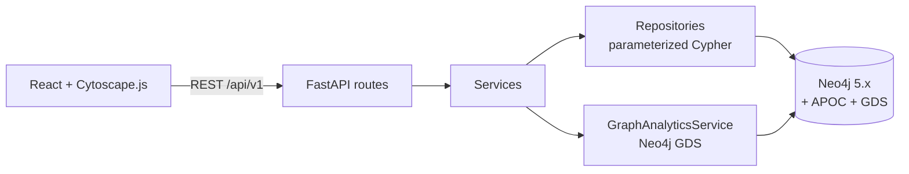
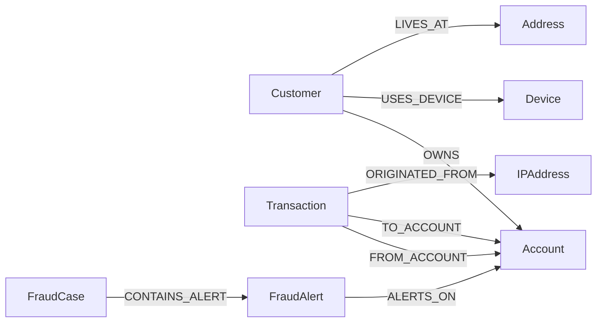

# Neo4j Fraud Detection Network

A graph-based fraud detection and investigation platform. Financial activity (customers,
accounts, transactions, devices, IP addresses, merchants) is modeled as a property graph in
Neo4j so that fraud investigators can traverse multi-hop connections -- shared devices,
circular transfers, fraud rings -- that are naturally expensive to compute as SQL joins.

This is a portfolio/demonstration project: a synthetic dataset, rule-based + graph-algorithm
detection, and a full-stack investigation platform (FastAPI + React + Cytoscape.js) built to
show real Neo4j, Cypher, and Graph Data Science engineering, not a production banking system.

## The business problem

A fraud team investigating a suspicious account needs answers to inherently *relational*
questions: who else uses this device? Is this account within a few hops of a known
fraudster? Does this transaction close a loop back to its origin? In a relational database
each of these is a growing chain of self-joins across junction tables that gets slower and
harder to reason about with every additional hop considered. In a graph database they are
single, bounded Cypher pattern matches -- and the *same* model that answers an analyst's ad
hoc question also powers the automated rule engine that flags accounts before anyone asks.
That's the core argument for Neo4j here: one graph, two consumers (rules + investigators),
instead of a transactional schema and a separate analytics schema that has to be kept in
sync.

## Features

- **Synthetic dataset generator** -- deterministic (seeded), CLI-configurable, produces
  5,000 customers / ~7,000 accounts / 50,000 transactions by default, with 10 intentionally
  planted fraud scenarios and a ground-truth CSV for evaluation.
- **Idempotent ingestion pipeline** -- batched `UNWIND`+`MERGE`, validated, rerunnable
  without duplicating data.
- **20+ documented investigation Cypher queries** -- shared device/IP detection, shortest
  path to confirmed fraud, circular transfer / fan-in / fan-out / structuring detection,
  dormant-account reactivation, foreign-IP transactions, and more.
- **10 configurable fraud detection rules (FD-001 - FD-010)** with an explainable, weighted
  risk-scoring model (0-100, LOW/MEDIUM/HIGH/CRITICAL) -- every score traces back to the
  specific rules and evidence that produced it.
- **Neo4j Graph Data Science** -- PageRank, Weakly Connected Components, Louvain community
  detection (feeds the suspicious-community rule), betweenness centrality, node similarity.
- **Full REST API** (FastAPI, OpenAPI docs, consistent typed error responses, pagination and
  filtering throughout).
- **React + TypeScript + Cytoscape.js investigation dashboard** -- dashboard analytics,
  search, account/customer investigation pages, a bounded-depth interactive graph explorer,
  fraud alerts, fraud communities, and investigation case management.
- **Ground-truth evaluation** -- precision/recall/F1 per rule against the planted scenarios.
- **Docker Compose** for the full stack; **GitHub Actions CI** running lint, type checks,
  and tests against a real Neo4j service container.

## Architecture

See [`docs/architecture.md`](docs/architecture.md) for the full breakdown (layering,
data flow, why Neo4j). Summary:



## Graph model

See [`docs/graph-model.md`](docs/graph-model.md) for the full node/relationship reference
and the reasoning behind every modeling decision (why transactions are nodes, why
devices/IPs/contact-details are separate node types, why `FraudAlert` and `FraudCase` are
kept apart).



## Local setup

Requires Docker Desktop, or Python 3.12+ and Node 20+ to run services outside containers.

```bash
cp .env.example .env
docker compose up --build   # starts Neo4j + backend + frontend
```

Or run the backend and frontend directly:

```bash
cd backend
python -m venv .venv
.venv/Scripts/pip install -r requirements.txt   # .venv/bin/pip on macOS/Linux
.venv/Scripts/python -m uvicorn app.main:app --reload

cd ../frontend
npm install
npm run dev   # http://localhost:5173
```

Check the backend is alive:

```bash
curl http://localhost:8000/api/v1/health
curl http://localhost:8000/api/v1/health/neo4j
```

OpenAPI docs: http://localhost:8000/docs (see also [`docs/api-documentation.md`](docs/api-documentation.md)
for worked examples).

## Dataset generation and ingestion

```bash
make generate-data   # writes CSVs to data/generated/, including fraud_ground_truth.csv
make import-data     # idempotent batched UNWIND+MERGE import into Neo4j
# or both:
make seed
```

Custom sizes/seed:

```bash
cd backend
python scripts/generate_dataset.py --customers 5000 --accounts 7000 --transactions 50000 \
    --fraud-rate 0.03 --seed 42 --output-dir ../data/generated
python scripts/import_dataset.py --data-dir ../data/generated
```

## Fraud scenarios

Ten scenarios are intentionally planted by the generator, each with a matching detection
rule -- see [`docs/fraud-rules.md`](docs/fraud-rules.md) for the full business description,
graph pattern, Cypher, thresholds, and known false-positive risk of every rule:

1. Shared device fraud ring (FD-001)
2. Shared IP address (FD-002)
3. Circular transactions (FD-003)
4. Rapid money movement / pass-through (FD-004)
5. Fan-in (FD-005)
6. Fan-out (FD-006)
7. Account takeover (FD-008)
8. Merchant collusion (evidenced via `GET /fraud/shared-devices` + community analysis)
9. Structuring (FD-007)
10. Fraud proximity (FD-009) -- normal-looking customers 1-3 hops from a confirmed fraudster

Suspicious-community detection (FD-010) is a cross-cutting eleventh signal built on Louvain
community detection rather than a single planted scenario.

Run detection and evaluate against ground truth:

```bash
make analyze-graph   # PageRank, WCC, Louvain (writes community_id, used by FD-010)
make detect-fraud    # runs analyze-graph, then all 10 rules
make evaluate         # precision/recall/F1 per rule vs. planted ground truth
```

## API examples

See [`docs/api-documentation.md`](docs/api-documentation.md) for full worked examples
(error format, account risk explanation, running detection, investigation case lifecycle,
analytics dashboard). Quick taste:

```bash
curl http://localhost:8000/api/v1/accounts/ACC-000001/risk
curl -X POST http://localhost:8000/api/v1/fraud/run-detection
curl http://localhost:8000/api/v1/analytics/dashboard
```

## Cypher examples

20+ documented queries live in
[`backend/app/cypher/analytics.cypher`](backend/app/cypher/analytics.cypher) (canonical,
human-readable reference) and are implemented as parameterized functions in
[`investigation_repository.py`](backend/app/repositories/investigation_repository.py). Example:

```cypher
// Devices shared by many customers (FD-001 evidence)
MATCH (d:Device)<-[:USES_DEVICE]-(c:Customer)
WITH d, collect(DISTINCT c.customer_id) AS customers, count(DISTINCT c) AS customer_count
WHERE customer_count >= $minimum_customers
RETURN d.device_id AS device_id, d.is_emulator, d.is_rooted, customer_count, customers
ORDER BY customer_count DESC;
```

## Graph Data Science

See [`docs/graph-model.md`](docs/graph-model.md) and
[`graph_analytics_service.py`](backend/app/services/graph_analytics_service.py) for the full
rationale per algorithm. Summary: **PageRank** prioritizes structurally central accounts for
investigation (not proof of fraud by itself); **WCC** finds isolated account clusters;
**Louvain** community detection feeds FD-010; **betweenness centrality** finds bridge/mule-
like accounts; **node similarity** surfaces customers who look alike by shared device/IP
usage. All algorithms run against a Cypher-projected, ephemeral account-transaction network
(`GraphAnalyticsService`, always dropped after use).

## Demo workflow

```bash
cp .env.example .env
docker compose up --build            # 1. start the stack
make generate-data && make import-data   # 2-3. generate + import
make detect-fraud                    # 4. run all fraud rules (incl. GDS pipeline)
open http://localhost:5173           # 5. dashboard
```

6. Search `ACC-003667` (or any account printed by `python backend/scripts/evaluate_detection.py`
   / found via `GET /api/v1/analytics/top-risky-accounts`) -- a real CRITICAL-risk account in
   the default seed (`--seed 42`) with `FD-001` (shared device, 17 customers, emulator+rooted),
   `FD-010` (suspicious community), and `FD-009` (2-hop fraud proximity) all firing.
7. View its risk score and reasons on the account page.
8. View connected devices/IPs and its shortest path to confirmed fraud on the same page.
9. Open its transaction network in the graph explorer.
10. Visit `/communities` to see the fraud community containing it.
11. Create a `FraudCase` from `/investigations`, linking the account's alerts.

## Development commands

See the [Makefile](Makefile): `make setup`, `make start`, `make stop`, `make reset`,
`make generate-data`, `make import-data`, `make seed`, `make analyze-graph`,
`make detect-fraud`, `make evaluate`, `make test`, `make lint`, `make typecheck`,
`make format`, `make benchmark`.

## Repository layout

```text
backend/    FastAPI app, Cypher, services, repositories, tests, scripts
frontend/   React + Vite + Cytoscape.js investigation dashboard
data/       generated datasets and ground-truth labels
docs/       architecture, graph model, fraud rules, performance, API docs
```

## Testing

Unit tests (`backend/tests/unit/`) cover risk scoring, generator determinism, and don't need
a database. Integration tests (`backend/tests/integration/`) run against a live Neo4j
instance (auto-skipped if unreachable) and cover ingestion idempotency, every investigation
query, the full REST API (via FastAPI's `TestClient`), the GDS pipeline, and one dedicated
fraud-scenario test per rule (`test_shared_device_detection`, `test_circular_transfer_detection`,
etc. in `test_fraud_detection_service.py`) that verifies the rule actually fires on its
planted ground-truth pattern, does not fire on an unrelated clean account, and does not
create duplicate alerts on a second run. Run with `make test`.

## Performance

See [`docs/performance.md`](docs/performance.md) for full EXPLAIN/PROFILE output on five
queries and a real case study: the first implementation of circular-transfer detection used
a textbook unbounded variable-length `MATCH` that never returned against realistic data
volume, and had to be rewritten as a bounded Cypher fetch + Python sliding-window scan. The
same class of bug (comparing all-time activity span instead of a genuine rolling window) was
found and fixed in fan-in/fan-out detection during development.

## Evaluation

`make evaluate` (or `python backend/scripts/evaluate_detection.py`) compares each rule's
current alerts against the dataset's planted ground truth and reports precision/recall/F1.
Results are not artificially perfect -- FD-002 (shared IP) in particular has low precision
because IP sharing happens legitimately and often in the synthetic data (CGNAT-like
patterns), which is realistic and documented in `docs/fraud-rules.md` rather than tuned away.

## Limitations

- Synthetic dataset -- not connected to any real banking system.
- Rule-based and graph-algorithm detection, not machine learning; thresholds are configured,
  not learned.
- Risk scores are demonstrative investigation-prioritization signals, not regulatory or
  legal determinations of fraud.
- Identity matching (shared device/IP/phone/address) is simplified -- no fuzzy matching,
  entity resolution, or deduplication of near-identical identifiers.
- FD-002 (shared IP) and FD-010 (suspicious community) have measured low precision on this
  dataset by design -- see `docs/fraud-rules.md` for why, and how they're meant to be used
  (as corroborating signals, not standalone triggers).
- No authentication/authorization is implemented (no API key/JWT, no investigator/admin role
  distinction) -- flagged as a "future improvements" item rather than implemented as a stub.

## Future improvements

- Streaming transaction ingestion (Kafka) and real-time incremental scoring instead of batch
  `run-detection`.
- Machine-learning-based link prediction and graph embeddings as an additional signal
  alongside the rule engine.
- Temporal graph analysis (how does an account's risk evolve over time, not just its current
  snapshot).
- Case-management workflow improvements (assignment, SLAs, audit trail).
- Role-based access control (investigator vs. administrator).
- Explainable graph machine learning and model monitoring, if/when a learned model
  supplements the current rule engine.
