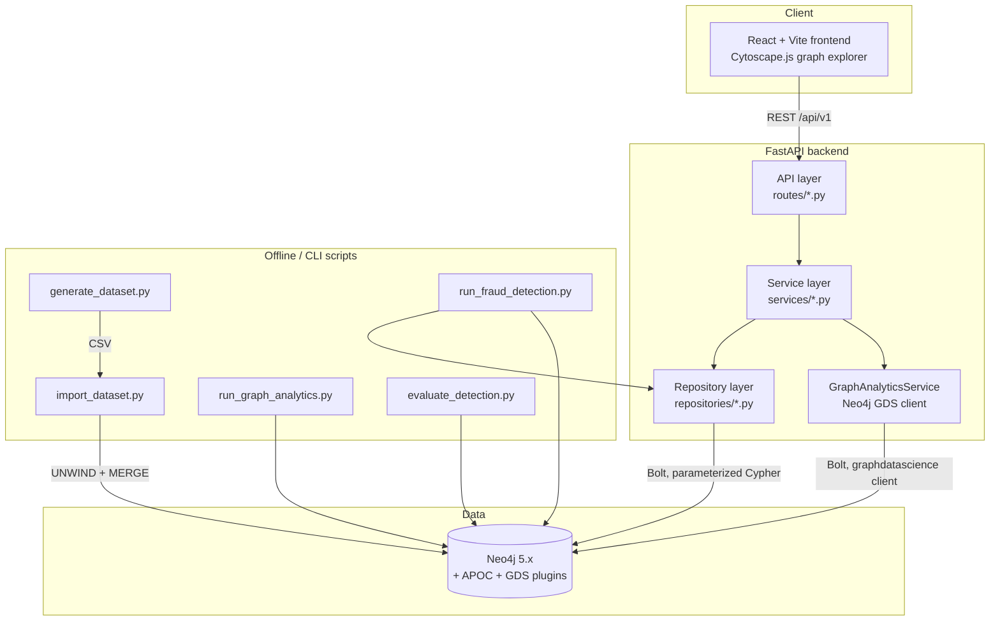

# Architecture

## System overview

## Layering

- **API layer** (`app/api/routes/*.py`) -- FastAPI route handlers. Parse/validate input,
  call one service method, return its result. No Cypher, no business logic here.
- **Service layer** (`app/services/*.py`) -- business logic: not-found handling, PII
  masking, score aggregation (`RiskScoringService`), rule orchestration
  (`FraudDetectionService`), GDS pipeline orchestration (`GraphAnalyticsService`).
- **Repository layer** (`app/repositories/*.py`) -- the only place Cypher text lives.
  Every query is parameterized and returns plain dicts (JSON-safe, via the
  `Neo4jConnection` temporal-type conversion described in `app/core/database.py`).
- **Core** (`app/core/*.py`) -- settings, the Neo4j driver wrapper, structured logging, and
  the typed exception hierarchy that maps to consistent `{"error": {...}}` HTTP responses.

This separation is what makes rules unit-testable (`RiskScoringService` takes signals in,
returns assessments out, no database involved) and keeps route handlers thin enough to audit
at a glance.

## Why Neo4j (and why not a relational database)

The business questions this platform answers are inherently multi-hop graph traversals:
"which accounts are within 3 hops of a confirmed fraudster, via any combination of shared
devices, IPs, addresses, or transactions?" In a relational schema this is a recursive CTE
across at least five different join tables (accounts, devices, device-usage, IPs,
transactions...), and the query gets slower and harder to reason about with every additional
hop or additional relationship type considered. In Neo4j the same question is a single
bounded variable-length pattern match, and the *same* graph model serves both the automated
rule engine and ad hoc analyst queries in Neo4j Browser -- there's no separate "analytics
schema" to keep in sync with the transactional one.

## Data flow (demo path)

1. `make generate-data` -- synthetic dataset generator writes CSVs to `data/generated/`,
   including a `fraud_ground_truth.csv` with the planted fraud scenarios (see
   `docs/fraud-rules.md`).
2. `make import-data` -- idempotent, batched UNWIND+MERGE ingestion into Neo4j.
3. `make analyze-graph` -- Neo4j GDS pipeline (PageRank, WCC, Louvain) writes
   `pagerank_score` / `wcc_component` / `community_id` back onto `Account` nodes.
4. `make detect-fraud` -- runs `analyze-graph` first (FD-010 depends on `community_id`),
   then all ten fraud rules, persisting `FraudAlert` nodes and per-entity risk scores.
5. Investigators use the REST API / React frontend to search, drill into
   accounts/customers, view the Cytoscape graph explorer, review alerts, and open
   `FraudCase` investigations.

## Frontend architecture

Plain React Query + Axios (no global state library needed -- server state *is* the state).
Pages call typed functions in `src/services/api.ts`, which call the FastAPI backend
directly; there is no separate frontend backend-for-frontend layer. The Cytoscape graph
explorer (`src/components/GraphView.tsx`) takes a generic `{nodes, edges}` payload (the same
shape every graph-returning endpoint uses, see `app/schemas/common.py`) so it's reused
identically for account networks, customer networks, and investigation-case graphs.
