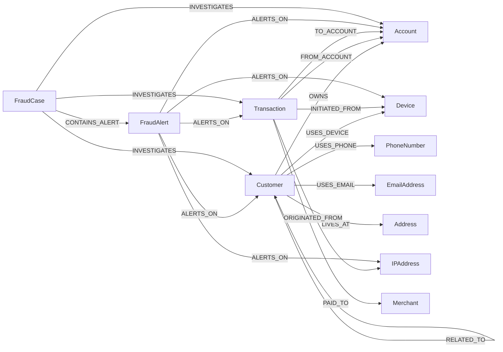

# Graph Model

This document describes every node label and relationship type in the fraud graph, the
reasoning behind the modeling choices, and the alternatives that were considered and
rejected. The canonical schema-creation statements live in
[`backend/app/cypher/constraints.cypher`](../backend/app/cypher/constraints.cypher) and
[`indexes.cypher`](../backend/app/cypher/indexes.cypher).

## Diagram

## Node reference

| Label | Identifier | Constraint | Key indexes | Cardinality (this dataset) |
|---|---|---|---|---|
| `Customer` | `customer_id` | unique | `fraud_status`, `country` | 5,000 |
| `Account` | `account_id` | unique | `risk_level`, `status` | ~7,000 (1-3 per customer) |
| `Transaction` | `transaction_id` | unique | `timestamp`, `is_flagged`, `risk_score` | 50,000 |
| `Device` | `device_id` | unique | `fingerprint` | 6,000 |
| `IPAddress` | `ip` | unique | `country` | 4,000 |
| `Merchant` | `merchant_id` | unique | - | 500 |
| `PhoneNumber` | `phone` | unique | - | 6,000 |
| `EmailAddress` | `email` | unique | - | 6,000 |
| `Address` | `address_id` | unique | - | 5,000 |
| `FraudAlert` | `alert_id` | unique | `severity`, `status` | grows with detection runs |
| `FraudCase` | `case_id` | unique | `status` | grows with investigator activity |

Full property lists match the project brief exactly (see `backend/scripts/ingestion/loaders.py`
for the authoritative `SET` clauses per label).

## Relationship reference

| Relationship | Direction | Properties | Cardinality |
|---|---|---|---|
| `(Customer)-[:OWNS]->(Account)` | Customer -> Account | - | 1:N |
| `(Customer)-[:USES_DEVICE]->(Device)` | Customer -> Device | `first_seen`, `last_seen`, `usage_count` | M:N |
| `(Customer)-[:USES_PHONE]->(PhoneNumber)` | Customer -> PhoneNumber | `verified`, `first_seen`, `last_seen` | M:N |
| `(Customer)-[:USES_EMAIL]->(EmailAddress)` | Customer -> EmailAddress | `verified`, `first_seen`, `last_seen` | M:N |
| `(Customer)-[:LIVES_AT]->(Address)` | Customer -> Address | `from_date`, `to_date`, `is_current` | M:N |
| `(Customer)-[:RELATED_TO]->(Customer)` | Customer -> Customer | `relationship_type`, `confidence_score` | M:N |
| `(Transaction)-[:FROM_ACCOUNT]->(Account)` | Transaction -> Account | - | N:1 |
| `(Transaction)-[:TO_ACCOUNT]->(Account)` | Transaction -> Account | - | N:1 (absent for non-transfer types) |
| `(Transaction)-[:INITIATED_FROM]->(Device)` | Transaction -> Device | - | N:1 |
| `(Transaction)-[:ORIGINATED_FROM]->(IPAddress)` | Transaction -> IPAddress | - | N:1 |
| `(Transaction)-[:PAID_TO]->(Merchant)` | Transaction -> Merchant | - | N:1 (only `CARD_PAYMENT`) |
| `(FraudAlert)-[:ALERTS_ON]->(*)` | FraudAlert -> any entity | - | N:1 |
| `(FraudCase)-[:CONTAINS_ALERT]->(FraudAlert)` | FraudCase -> FraudAlert | - | M:N |
| `(FraudCase)-[:INVESTIGATES]->(*)` | FraudCase -> Customer/Account/Transaction | - | M:N |

## Modeling decisions

### Why transactions are nodes, not relationships

The obvious alternative is `(Account)-[:TRANSFERRED {amount, timestamp, ...}]->(Account)`.
This was rejected because a transaction needs to connect to more than two things: an
originating device, an originating IP address, optionally a merchant, and potentially one or
more `FraudAlert`/`FraudCase` nodes. Neo4j relationships can only connect exactly two nodes,
so a transaction-as-relationship model would need a second parallel node anyway to hang the
device/IP/merchant/alert connections off of -- at which point it's simpler and more direct to
just make the transaction itself the node. Modeling it as a node also lets every transaction
carry its own identity (`transaction_id`) that alerts, cases, and API responses can reference
directly, and lets `MATCH (t:Transaction)` carry its own indexes (`timestamp`, `is_flagged`,
`risk_score`) independent of either endpoint account.

The trade-off: every transfer is a 2-hop path (`Account-[:FROM_ACCOUNT]-Transaction-[:TO_ACCOUNT]-Account`)
instead of a 1-hop edge, which is why cycle/fan-in/fan-out detection queries traverse
`FROM_ACCOUNT|TO_ACCOUNT` in pairs (2 relationship-hops per real "step").

### Why devices and IP addresses are separate node types (not Transaction properties)

A device or IP used by many unrelated customers is itself the fraud signal (FD-001, FD-002)
-- that only works if the device/IP is a first-class node that many `USES_DEVICE` /
`ORIGINATED_FROM` edges can point at. If `device_id` / `ip` were just string properties on
`Customer` or `Transaction`, answering "which other customers share this device" would
require a property-equality scan across every customer instead of a relationship traversal,
and the device's own attributes (`is_emulator`, `is_rooted`, `is_vpn`, `is_proxy`, `is_tor`)
would have to be duplicated onto every transaction/customer that touched it rather than
living in one place.

### Why contact details (phone, email, address) are nodes, not Customer properties

Same reasoning as devices/IPs: shared phone numbers and addresses are themselves evidence of
undisclosed relationships between "unrelated" customers (FD-009 proximity, the
`find_customers_sharing_address_or_phone` query). A `Customer.phone` string property can't be
efficiently joined against every other customer's phone without a full scan; a `PhoneNumber`
node with `USES_PHONE` edges from every customer who has used it makes "who else uses this
number" a one-hop traversal. It also naturally supports a customer having used multiple
phone numbers or emails over time, each usage carrying its own `first_seen`/`last_seen`.

### Why `FraudAlert` and `FraudCase` are separate node types

An alert is one rule's automated finding at a point in time -- narrow, machine-generated,
and re-derivable by rerunning detection (which is why alert identity is deterministic:
`ALERT-<rule_id>-<entity_type>-<entity_id>`, see `fraud_repository.py`). A case is an
investigator's unit of work: it bundles alerts (possibly from different rules, possibly
spanning multiple related entities), carries a human workflow status
(`OPEN` -> `IN_REVIEW` -> `RESOLVED`/`FALSE_POSITIVE`), a priority, an assignee, and an
eventual resolution note. Collapsing these into one node would conflate "the system flagged
this" with "a human is working this" -- an alert can exist for months with no case, and a
case can contain alerts from ten different rules across five different accounts. Keeping
them separate also means rerunning fraud detection never touches (or risks corrupting) an
investigator's in-progress case data.

### Why graph relationships support multi-hop investigation

Every relationship in this model was chosen so that the fraud questions in the project brief
("shortest path to a confirmed fraudster", "shared device/IP/phone/address", "circular
transfers") are natural bounded-hop graph patterns rather than recursive SQL joins. This is
the core argument for using Neo4j at all: `MATCH (a)-[:USES_DEVICE]->(d)<-[:USES_DEVICE]-(b)`
is one line and one index-seek-driven traversal; the equivalent in a relational schema is a
self-join through a device-usage junction table that gets more expensive and harder to read
with every additional hop (shared device -> shared IP -> two hops from a confirmed fraud
account, for instance).

## Query optimization implications

- Indexes exist on every property actually used as a filter predicate by a shipped query
  (see `docs/performance.md` for the one property, `Transaction.amount`, that was
  deliberately left unindexed and why).
- Variable-length traversals are always hop-bounded (`[*1..3]`, never `[*]`) -- see
  `docs/performance.md`'s case study on the circular-transfer query that had to be rewritten
  after an unbounded version failed to terminate.
- `FraudAlert` and `FraudCase` identifiers are deterministic and idempotent-write-friendly
  (`MERGE`-based) so re-running detection or re-importing data never creates duplicates.
